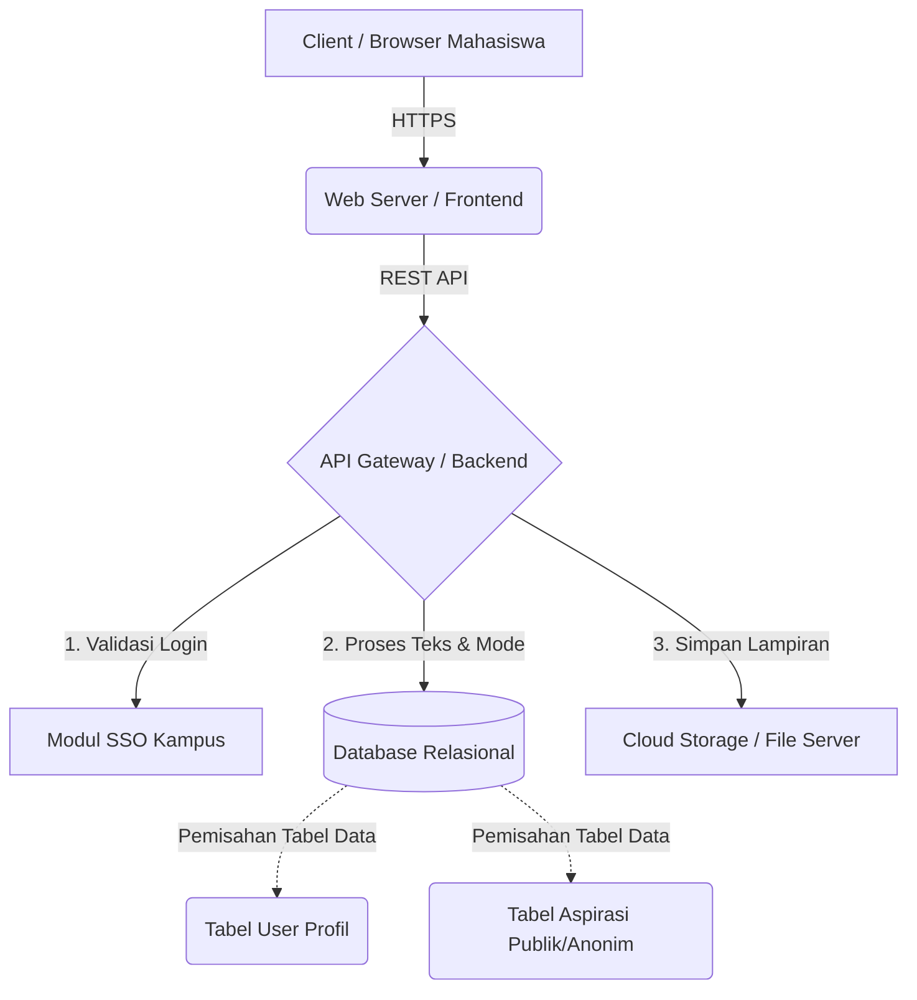

# Dokumen Desain Layanan: Sistem Aspirasi Mahasiswa
**Tim:** [Nama Kelompok]
**Fokus Fitur Utama:** Pengiriman Aspirasi (Mode Terbuka & Anonim)

## 1. Kebutuhan Terpilih dan Asumsi

**Kebutuhan Sistem:**
- Sistem harus memfasilitasi pengiriman formulir aspirasi dengan opsi visibilitas identitas pengguna (Mode Anonim atau Terbuka).
- Sistem harus mampu memproses dan menyimpan lampiran bukti berupa foto atau dokumen.
- Sistem menyediakan nomor resi/ID pelacakan unik untuk memantau status tindak lanjut laporan.

**Asumsi Tim:**
- Pengguna (mahasiswa, dosen, kaprodi) sudah memiliki akun email kampus (SSO) yang aktif.
- Infrastruktur basis data (PostgreSQL) dan penyimpanan objek (Object Storage untuk file) sudah tersedia dan terhubung dengan *backend*.

## 2. Daftar Modul Beserta Tanggung Jawab

| Nama Modul | Tanggung Jawab |
| :--- | :--- |
| **Modul Autentikasi (Auth)** | Mengelola proses *login* SSO email kampus, memvalidasi token sesi pengguna, dan mengatur otorisasi peran (Mahasiswa vs. Dosen/Kaprodi). |
| **Modul Manajemen Aspirasi** | Memproses data teks dari formulir, mengenkripsi/menyembunyikan identitas jika mode anonim dipilih, dan menyimpan entitas laporan ke basis data. |
| **Modul Storage (Penyimpanan)** | Memvalidasi tipe file (gambar/dokumen) dan ukuran lampiran (maksimal 5MB), lalu mengunggahnya ke *cloud/local storage* terpusat. |
| **Modul Pelacakan Status** | Menghasilkan ID unik untuk setiap laporan, serta menyediakan API untuk memperbarui dan mengambil riwayat status (Diterima, Ditinjau, Selesai). |

## 3. Diagram Arsitektur dan Label Hubungan

*(Catatan: Diagram visual pendamping tersimpan di `docs/architecture.png`. Berikut adalah representasi logika arsitekturnya)*

**Label Hubungan:**
- **Client ke Web Server:** Interaksi *user interface*, pengisian form, dan permintaan data status.
- **Backend ke SSO:** Memastikan pengguna adalah civitas akademika UIN Jakarta yang sah.
- **Backend ke Database:** Menyimpan data terstruktur. Tabel dipisah antara data identitas pengguna dan data isi aspirasi untuk menjamin keamanan mode anonim.
- **Backend ke Cloud Storage:** Menyimpan file statis (foto bukti) agar tidak membebani database utama.

## 4. Alur Satu Fitur (Pengiriman Aspirasi)

**Skenario Berhasil:**
1. Mahasiswa melakukan *login* menggunakan SSO Kampus.
2. Mahasiswa membuka halaman "Kirim Aspirasi".
3. Mahasiswa mengisi Kategori, Judul, Deskripsi, dan mengunggah Lampiran (Foto).
4. Mahasiswa mencentang opsi "Kirim sebagai Anonim".
5. Mahasiswa menekan tombol "Kirim".
6. *Sistem memvalidasi file lampiran.*
7. Sistem mengenkripsi/melepas kaitan ID pengguna dengan isi laporan, menyimpannya ke database, dan menyimpan file ke storage.
8. Sistem mengembalikan pesan sukses beserta **Nomor Pelacakan Laporan (Tracking ID)**.

**Skenario Gagal (Kondisi Gagal):**
- Pada langkah ke-6, sistem mendeteksi ukuran file foto mahasiswa adalah 10MB (melewati batas maksimal 5MB).
- *Backend* menolak permintaan (mengirimkan status *Error 400 Bad Request*).
- Sistem membatalkan penyimpanan, lalu menampilkan *pop-up* error kepada mahasiswa: "Gagal mengirim aspirasi. Ukuran file maksimal adalah 5MB. Silakan kompresi gambar Anda dan coba lagi."

## 5. Dua Keputusan Desain dan Alasannya

1. **Keputusan:** Mewajibkan login SSO meskipun menyediakan fitur pengiriman Anonim.
   - **Alasan:** Ini memastikan bahwa pelapor benar-benar mahasiswa atau bagian dari masyarakat kampus UIN Jakarta yang sah, menghindari serangan *spam* atau laporan palsu dari bot internet. Privasi anonim dijamin di level aplikasi (nama disembunyikan dari tampilan Kaprodi/Dosen), bukan dengan membiarkan sistem terbuka tanpa autentikasi.

2. **Keputusan:** Memisahkan tabel identitas pengguna (`users`) dan tabel isi laporan (`aspirations`) secara tegas di tingkat basis data.
   - **Alasan:** Memberikan jaminan keamanan tingkat lanjut (keamanan dan privasi dari *non-functional requirements*). Jika mode anonim aktif, sistem hanya akan menyimpan token atau ID samaran pada tabel `aspirations`, sehingga administrator basis data sekalipun akan kesulitan mencocokkan laporan sensitif dengan identitas asli pelapor.